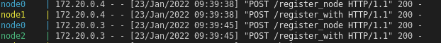

# python blockchain app
 
Un simple tutorial de como implementar blockchain con python y docker. Tiene muchas vulnerabilidades, que con un poco más de desarrollo, pueden ser suplidas. Este es un simple ejemplo para entender cómo funciona.
 
## Instrucciones para correr el proyecto

Debemos tener instalado Docker y docker-compose en nuesta pc.

* [Install Docker Engine on Debian](https://docs.docker.com/engine/install/debian/).
* [Install Docker Compose](https://docs.docker.com/compose/install/).
 
Clonar el proyecto,
 
```sh
$ git clone https://github.com/pinduvn/blockchain.git
```
 
Correr el docker-compose,
 
```sh
$ cd blockchain
$ docker-compose up
```
Conectar los distintos nodos,
```sh
$ docker exec -i node1 \
    curl -X POST http://node1:8000/register_with \
    -H 'Content-Type: application/json' \
    -d '{"node_address": "http://node0:8000"}'
$ docker exec -i node2 \
    curl -X POST http://node2:8000/register_with 
    -H 'Content-Type: application/json' 
    -d '{"node_address": "http://node0:8000"}'
```
 
Ahora una instancia de nuestros nodos blockchain está iniciada y corriendo en el puerto 8000 de cada uno.
 
Una vez registrados los nodos, podemos ver los IP de cada uno en la terminal donde corre el docker-compose.
 

 
Corremos la aplicación en una terminal nueva,
```sh
$ python run_app.py
```
La aplicación es accesible a través del siguiente link [http://localhost:5000](http://localhost:5000). La aplicación por defecto se conecta al nodo0, pero este puede modificarse cambiando el puerto en la app, solo hay que cambiar el valor en la siguiente constante **`CONNECTED_NODE_ADDRESS = "http://127.0.0.1:8000"`**, el nodo1 tiene el puerto **`8001`**  y el nodo2 tiene el puerto **`8002`**
 
Podemos ver la cadena en cada nodo, podemos cambiar localhost por el ip de cada nodo,
 
```sh
$ curl -X GET http://localhost:8000/chain
```
 
Una vez finalizado todo esto, se puede comenzar a crear transacciones cargando posteos y minándolos, Esto ya se pueden consultar en la cadena de cada uno de los nodos.
 
```sh
$ curl -X GET http://localhost:8001/chain
$ curl -X GET http://localhost:8002/chain
```
 
 
## Referencias
 
* [1] [step-by-step implementation tutorial](https://gist.github.com/satwikkansal/4a857cad2797b9d199547a752933a715). Última consulta 2022-01.
* [2] [https://docs.docker.com/](https://docs.docker.com/). Última consulta 2022-01.